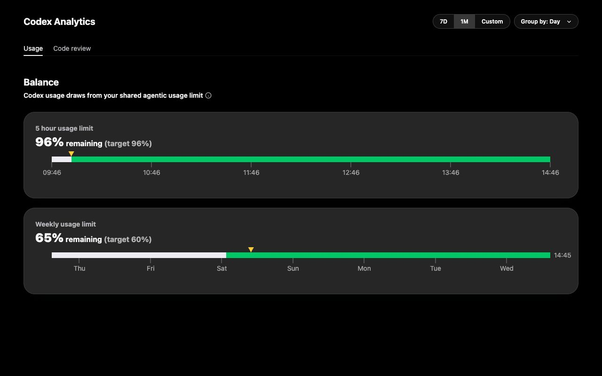

# Codex Usage Pacer

Codex Usage Pacer is an unofficial Chrome extension that adds pacing markers,
local history, and reset-change evidence to the Codex usage dashboard:

`https://chatgpt.com/codex/cloud/settings/analytics`

It is designed for people who want to understand how their displayed quota
changes over time without running a separate server or continuously polling in
the background.



The screenshot uses representative values and contains no account data.

## Features

- Adds even-pace targets and time-axis tick marks to visible usage cards.
- Records every observed change in remaining weekly usage.
- Records every observed change in the displayed reset time.
- Keeps focus-triggered observation coverage so changes are not presented as
  if they were detected continuously.
- Shows a calendar with daily usage traces and reset-change markers.
- Preserves visible quota-card and reset-credit evidence, including missing or
  unparsable values.
- Refreshes the Analytics page after its tab or window regains focus.
- Stores all extension data locally in Chrome.

There is no timer-based background polling, analytics service, remote code, or
companion server.

## Install

### Chrome Web Store

The unlisted Chrome Web Store link will be added after the first review. Store
installs receive automatic updates from Chrome.

### Development Build

1. Download or clone this repository.
2. Open `chrome://extensions`.
3. Enable **Developer mode**.
4. Choose **Load unpacked** and select the repository folder.
5. Open or reload the Codex usage dashboard.

Unpacked extensions do not auto-update. Pull the latest source and use
**Reload** on `chrome://extensions` after an update.

## Privacy

The extension reads only the quota and reset information rendered on the Codex
usage dashboard. It stores observations in `chrome.storage.local` and does not
transmit them anywhere. See [PRIVACY.md](PRIVACY.md) for the complete policy.

## Development

No package installation is required. Node.js 20 or newer and the system `zip`
utility are enough.

```sh
npm test
npm run check
npm run package
```

The package command creates a versioned Chrome Web Store upload in `dist/` and
includes only the manifest, runtime scripts, and PNG icons.

Open `dev/mock.html` directly for a standalone styling fixture. It uses
representative data and does not require a signed-in ChatGPT session.

## Releases

1. Update the version in `manifest.json` and `package.json`.
2. Add the user-facing changes to `CHANGELOG.md`.
3. Run `npm test` and `npm run package`.
4. Commit, tag the commit as `vX.Y.Z`, and push the tag.
5. Upload the generated ZIP to the existing Chrome Web Store item.

GitHub Actions validates every push. A version tag also creates a GitHub release
with the packaged extension attached.

## Disclaimer

This project is not affiliated with, endorsed by, or sponsored by OpenAI.
OpenAI and Codex are trademarks of their respective owner.

## License

[MIT](LICENSE)
