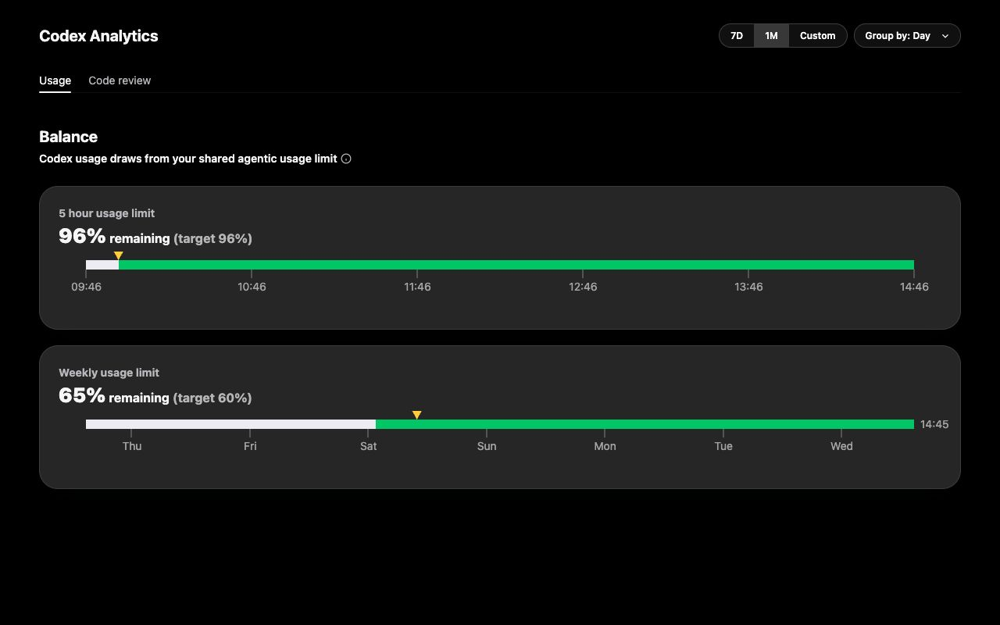

# Codex Usage Pacer

Codex Usage Pacer is an unofficial Chrome extension that adds pacing markers,
local history, and reset-change evidence to the Codex usage page:

`https://chatgpt.com/settings/usage`

The legacy dashboard at `https://chatgpt.com/codex/cloud/settings/analytics`
is still supported.

It is designed for people who want to understand how their displayed quota
changes over time without running a separate server or continuously polling in
the background.



The screenshot shows the 0.9 layout with representative values and contains no
account data.

## Features

- Adds even-pace targets and time-axis tick marks to visible usage cards.
- Colors usage bars continuously: green on pace, blending toward blue for a
  surplus or red for a deficit, reaching full color at 20 percentage points.
- Links public reset forecasts and their supporting announcements, with
  immediate probability and provenance tooltips.
- Marks high-confidence, source-supported reset times on the usage bar without
  changing the official pacing target.
- Records every observed change in remaining weekly usage.
- Records every observed change in the displayed reset time.
- Keeps focus-triggered observation coverage so changes are not presented as
  if they were detected continuously.
- Shows a calendar with daily usage traces and reset-change markers.
- Preserves visible quota-card and reset-credit evidence, including missing or
  unparsable values.
- Supports the redesigned Usage settings page (settings rows, native progress
  bars, `Weekly limit` and `% left`) and reads the exact reset time from its
  countdown tooltip; rounded countdowns are never turned into timestamps.
- Estimates the credit balance as a share of one Pro 20x week, using a
  provisional, community-reported 55,000-credit denominator that is labeled as
  an estimate.
- Keeps an optional, locally saved credit-expiration ledger: record grants and
  their expiration dates to see estimated credits per expiration date. The page
  exposes only a combined balance, so the split is an estimate.
- Plots credit-balance history (24 hours, 7 days, 30 days, or everything) with
  point details and an estimated daily decline.
- Links the Codex and Claude reset trackers and OpenAI's status page below the
  weekly usage bar.
- Refreshes the usage page after its tab or window regains focus.
- Stores all extension data locally in Chrome.

There is no timer-based background polling, analytics service, remote code, or
companion server.

## Forecasts and Pacing

The yellow marker and target percentage always use OpenAI's reported reset
time. Forecasts are separate evidence, never a reason to change the pacing
calculation or the stored reset history.

Bar color uses `remaining - target` in percentage points, not a percentage of
the target. Green means on pace. A surplus blends toward blue (room to use
more); a deficit blends toward red (spent ahead of pace). The blend reaches
full blue or red at 20 points and stays capped beyond that. For example,
95% remaining against a 99% target is only 20% of the way toward red. Hover
the target to see the unrounded comparison and color meaning. Colors use
perceptual Oklab interpolation and do not change pacing or observation history.

The extension fetches the public [Codex Reset Monitor](https://codexreset.org/)
after the dashboard loads, including focus-triggered refreshes. Its tooltip
shows the monitor's 24-hour and 48-hour probabilities, the probability for the
24-to-48-hour interval, the window's start time, and available calibration
information. These are an independent monitor's estimates for a whole window,
not OpenAI guarantees or probabilities for a particular hour.

At a published 48-hour probability of at least 80%, an explicit future
announcement within the next week and before the official reset gets a blue
marker. The announcement links directly to its source post; the probability
links separately to the monitor. Without a source-supported clock time, the
extension shows only the probability window, with no invented point marker.

"Today" and "tomorrow" are anchored to the source post's publication date and
stated timezone. Ambiguous PST/PDT wording can produce a small range, explained
in the tooltip. Passed announcements stay passed, and newer reset-related
statements supersede older timing.

The service worker wakes only for a forecast request. It sends no quota data or
cookies to the monitor, caches only a structured snapshot, and can reuse that
snapshot for up to two hours after a failed fetch. There are no alarms,
intervals, or background polling loops.

## Install

Releases are distributed on GitHub; a Chrome Web Store account is not needed.

1. Download the extension ZIP from the [latest release](https://github.com/DiegoZC4/codex-usage-pacer/releases/latest)
   and extract it into a folder you will keep. Cloning this repository also works.
2. Open `chrome://extensions`.
3. Enable **Developer mode**.
4. Choose **Load unpacked** and select the folder containing `manifest.json`.
5. Open or reload the Codex usage dashboard.

## Update

Unpacked extensions do not auto-update. Download the latest release and replace
the files inside your existing extension folder, keeping its path unchanged.
For a Git checkout, use `git pull --ff-only` instead. Then use **Reload** for
Codex Usage Pacer on `chrome://extensions` and refresh the dashboard. Chrome may
ask you to approve the new public-forecast host permission when upgrading from
0.8.0.

Keep the existing installation: do not remove and reinstall the extension or
clear its storage, since that can delete your local history. Updates retain the
existing history format.

For agent-assisted development, Chrome DevTools MCP's `list_extensions` and
`reload_extension` tools can reload the existing installation on demand after
an edit. This is optional, requires normal browser authorization, and does not
add a watcher, a clone profile, or a companion server to the extension.

## Privacy

The extension reads the quota and reset information rendered on the Codex usage
dashboard and the monitor's public forecast page. It stores observations in
`chrome.storage.local` and does not transmit them anywhere. The forecast fetch
does disclose ordinary request metadata, such as your IP address, to the
monitor's host. See [PRIVACY.md](PRIVACY.md) for the complete policy.

## Development

No package installation is required. Node.js 20 or newer and the system `zip`
utility are enough.

```sh
npm test
npm run check
npm run package
```

The package command creates a versioned extension ZIP in `dist/` and includes
only the files `manifest.json` loads (runtime scripts and PNG icons) plus the
license for the embedded Lucide icons. Personal observations,
reference captures, and legacy server files are not bundled.

Open `dev/mock.html` directly for a standalone styling fixture. It uses
representative data and does not require a signed-in ChatGPT session.

Open `dev/forecast-browser-test.html` directly to check the actual forecast and
content scripts against mocked Chrome storage and a sample usage card. Use
`?width=360` for a narrow card or `?mode=window` for a probability-only forecast.
The fixture never writes real extension history.

`dev/usage-layout-browser-test.html` checks the redesigned Usage settings page:
settings rows, the exact reset tooltip, decimal balances, preserved history, and
repeated annotation without duplicate overlays. `dev/credit-expiry-browser-test.html`
checks the credit-expiration ledger and editor. Both use isolated mock storage.

## Releases

1. Update the version in `manifest.json` and `package.json`.
2. Add the user-facing changes to `CHANGELOG.md`.
3. Run `npm test` and `npm run package`.
4. Commit, tag the commit as `vX.Y.Z`, and push the branch and tag.
5. Verify the GitHub Actions release and attached extension ZIP.

GitHub Actions validates every push. A version tag also creates a GitHub release
with the packaged extension attached.

## Disclaimer

This project is not affiliated with, endorsed by, or sponsored by OpenAI.
OpenAI and Codex are trademarks of their respective owner.

## License

[MIT](LICENSE)
